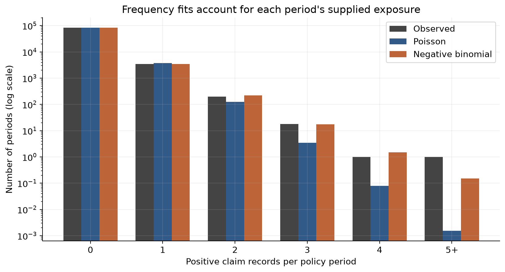
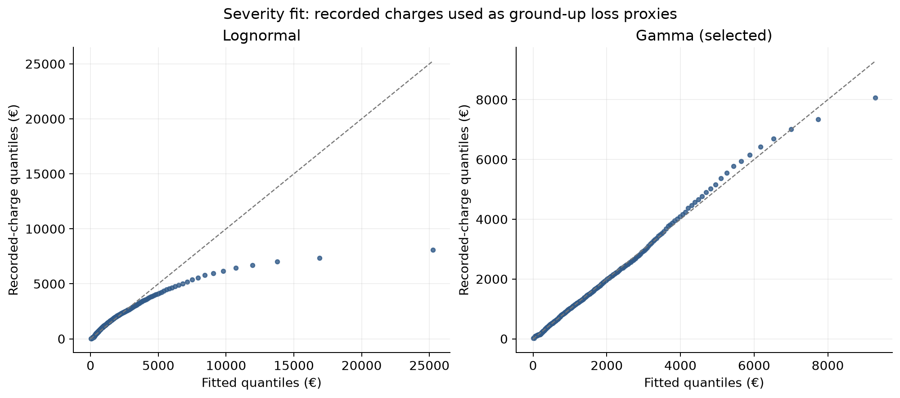
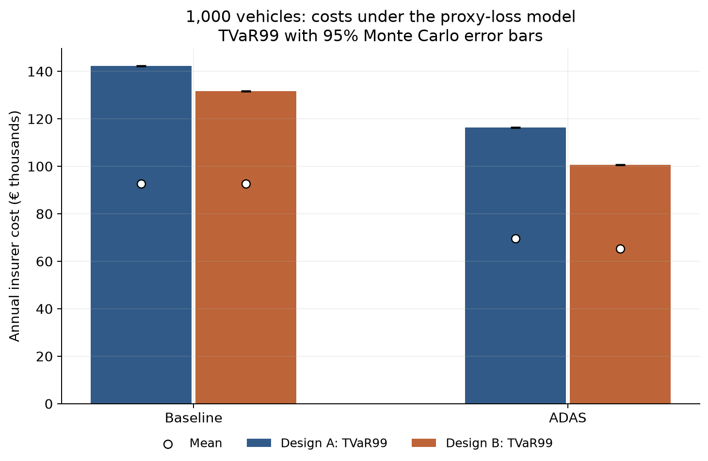
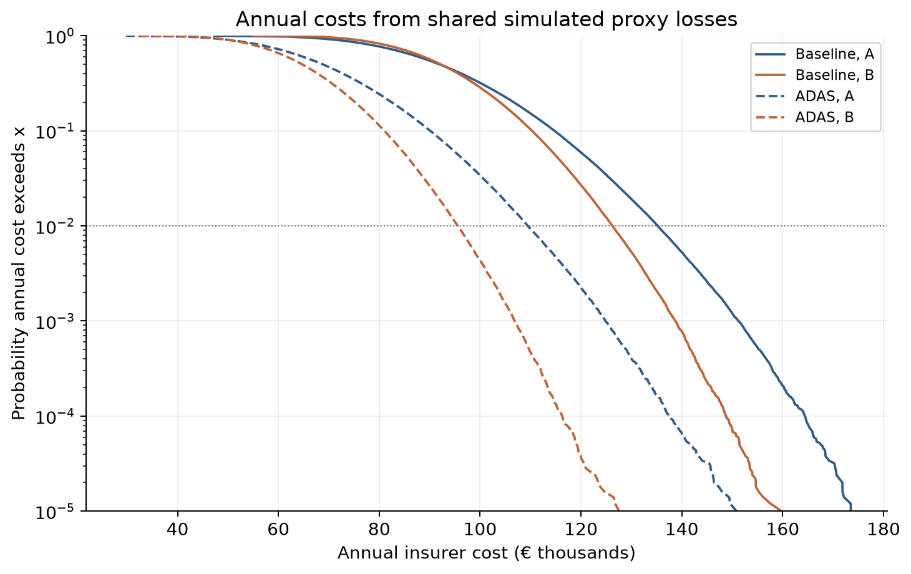
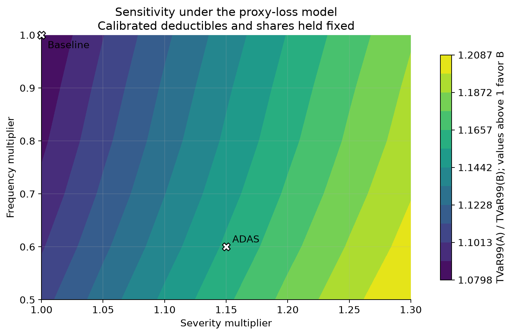

# Contract simulation

**Recorded ClaimCharge values are proxies for ground-up losses, not verified ground-up repair costs.** All euro amounts are on the recorded historical-charge scale. Results are conditional on the fitted models and assumptions below.

Completed 500,000 simulated years of 1,000 vehicles at every scenario/grid point; seed 20260907. Numerical checks: 0 failures, 0 warnings. Cleaned input files were not modified.

Run: `uv run src/run_pipeline.py --stage simulation`. The default command reuses existing cleaned files; `--stage processing` explicitly refreshes them.

## Main finding

ADAS: B has lower TVaR99; A/B TVaR99 ratio 1.156761, MC SE 0.000487, 95% MC interval [1.155807, 1.157714].

B has lower TVaR99 at every tested grid point; ratios range from 1.0798 to 1.2087. This is an insurer-tail ranking under the proxy-loss model, not an overall welfare ranking.

Policyholder tradeoff in the ADAS scenario: expected annual retention per vehicle is €50.77 for A and €55.15 for B. The lower insurer cost comes with greater expected policyholder retention under B.

## Training data and model fits

All 87,228 coverage periods are retained, including 83,501 zero-count periods. Supplied Exposure totals 38,538.25; 0 periods have zero exposure. Existing ClaimNbClean sums to 3,969, exactly matching 3,969 positive cleaned claim rows both overall and at (PolicyID, LicNb, Year, BeginDate, EndDate). No counts are rebuilt from the older two-field join in the spec's R example.

Frequency: intercept-only Poisson and NB2 maximum likelihood, mean per period = annual rate × supplied Exposure. Zero-exposure/zero-count periods, if present, contribute their exact probability-one outcome. NB2 is selected when its AIC is lower and Poisson's Pearson dispersion exceeds one. NB2 variance = mean + mean²/theta; alpha = 1/theta. The varying-exposure NB2 rate need not equal the raw count/exposure ratio. See the [NB2 model definition](https://www.statsmodels.org/stable/generated/statsmodels.discrete.discrete_model.NegativeBinomial.html).

| Model | Annual rate | Theta | Alpha | Log likelihood | AIC | BIC | Pearson/df | Fitted total count | Converged | Selected |
|---|---|---|---|---|---|---|---|---|---|---|
| Poisson | 0.102989 | - | - | -15,608.005648 | 31,218.011296 | 31,227.387577 | 1.118692 | 3,969 | Yes | No |
| Negative binomial | 0.103236 | 0.92501 | 1.08107 | -15,551.424115 | 31,106.848231 | 31,125.600792 | 1.066656 | 3,978.523855 | Yes | Yes |

Severity: maximum likelihood with location fixed at zero; lower AIC selects the model, with QQ and distribution-distance diagnostics reported alongside. KS and Anderson–Darling values are descriptive; no ordinary fitted-parameter KS p-value is claimed. Gamma uses shape and scale (rate = 1/scale); lognormal uses sigma = shape and mu_log = log(scale). Parameter conventions follow [SciPy lognormal](https://docs.scipy.org/doc/scipy/reference/generated/scipy.stats.lognorm.html) and [gamma](https://docs.scipy.org/doc/scipy/reference/generated/scipy.stats.gamma.html).

| Model | Shape | Scale | Log likelihood | AIC | BIC | KS | AD | Fitted mean | Fitted q99 | Selected |
|---|---|---|---|---|---|---|---|---|---|---|
| Lognormal | 1.098024 | 1,070.723975 | -33,691.019255 | 67,386.038511 | 67,398.611049 | 0.072421 | 39.786821 | 1,956.512082 | 13,773.1457 | No |
| Gamma | 1.235785 | 1,367.444882 | -33,415.973419 | 66,835.946837 | 66,848.519376 | 0.019534 | 1.711733 | 1,689.868033 | 7,008.616521 | Yes |

## Contracts and calibration

Payment is `share * max(proxy_loss - deductible, 0)`. Calibrate B's share only against A using analytic severity partial moments under the unshifted selected model. Deductibles and shares are then fixed for every grid point.

| Stage | Design | Deductible (€) | Insurer share |
|---|---|---|---|
| Initial | A | 1,000 | 1 |
| Initial | B | 250 | 0.8 |
| Calibrated | A | 1,000 | 1 |
| Calibrated | B | 250 | 0.618312 |

Calibrated expected payment per claim: A = €897.320106; B = €897.320106. Expected baseline annual fleet cost = €92,635.484165. A/B calibration gap (B minus A): €0 per claim, relative gap 0; required relative tolerance 1.0e-08.

Observed Deduc labels: 0 euro, 1-200 euros, 201-300 euros, 301-400 euros, 401-600 euros, >600 euros. The starting €250 deductible falls in 201–300 euros; €1,000 is compatible with the open >600 band, which does not establish an exact sold deductible.

## Annual insurer results

Amounts are euros per 1,000-vehicle fleet year. MC SE is shown for each tail measure. Mean MC SE, analytic mean/SD, and all sensitivity rows are also exported to `simulation_insurer.csv`.

| Scenario | Design | Mean | SD | VaR95 | SE | VaR99 | SE  | TVaR99 | SE   |
|---|---|---|---|---|---|---|---|---|---|
| ADAS | A | 69,614.582431 | 15,581.830601 | 96,657.247859 | 55.298993 | 109,453.983873 | 104.437003 | 116,374.673612 | 132.467117 |
| ADAS | B | 65,228.342669 | 12,043.110698 | 85,949.017544 | 40.341165 | 95,563.459147 | 79.751283 | 100,603.94436 | 96.761979 |
| Baseline | A | 92,673.242918 | 16,849.468493 | 121,634.151439 | 58.493284 | 135,196.766748 | 104.182327 | 142,268.478378 | 135.396333 |
| Baseline | B | 92,661.246012 | 13,519.505501 | 115,671.278205 | 45.37668 | 126,250.835541 | 82.70187 | 131,758.507777 | 105.452286 |

A/B ratios and mean differences use paired years. A ratio above one favors B on TVaR99.

| Scenario | TVaR A/B | Ratio MC SE | 95% lower | 95% upper | Mean A−B (€) | Paired mean SE (€) |
|---|---|---|---|---|---|---|
| ADAS | 1.156761 | 0.000487 | 1.155807 | 1.157714 | 4,386.239761 | 6.263987 |
| Baseline | 1.079767 | 0.000428 | 1.078928 | 1.080606 | 11.996907 | 6.682368 |

## Retention and contract diagnostics

Expected retention comes from model moments. Annual retention per vehicle includes zero-claim years. Retention share = expected retained loss / expected total proxy loss. Threshold probabilities are per claim, separately for A and B; model and simulated probabilities are both shown.

| Scenario | Design | Retention/claim (€) | Retention/vehicle/year (€) | Retention share | Below d (model) | Below d (MC) |
|---|---|---|---|---|---|---|
| ADAS | A | 819.613243 | 50.768016 | 0.421753 | 0.363435 | 0.363501 |
| ADAS | B | 890.360989 | 55.150233 | 0.458158 | 0.084054 | 0.084031 |
| Baseline | A | 792.547927 | 81.819253 | 0.469 | 0.411836 | 0.411796 |
| Baseline | B | 792.547927 | 81.819253 | 0.469 | 0.098623 | 0.098588 |

Below-deductible proxy losses generate zero insurer payment and could go unreported in future insurer data. Above-deductible payments grow with loss at the insurer's share. For a positive payment, the proxy loss can be recovered as deductible + payment/share when the terms are known. Truncation or censoring already present in the recorded training charges is not repaired here.

## Sensitivity

Frequency grid: (0.5, 0.6, 0.7, 0.8, 0.9, 1.0); severity grid: (1.0, 1.05, 1.1, 1.15, 1.2, 1.25, 1.3). Each cell uses 500,000 simulated years for both designs. The contour interpolates between simulated cells; it does not add simulation points.

All grid ratios and Monte Carlo uncertainty

| Frequency × | Severity × | TVaR A/B | MC SE | 95% lower | 95% upper |
|---|---|---|---|---|---|
| 0.5 | 1 | 1.107903 | 0.000571 | 1.106784 | 1.109021 |
| 0.5 | 1.05 | 1.127937 | 0.000551 | 1.126856 | 1.129017 |
| 0.5 | 1.1 | 1.146493 | 0.000536 | 1.145444 | 1.147543 |
| 0.5 | 1.15 | 1.163723 | 0.000517 | 1.16271 | 1.164737 |
| 0.5 | 1.2 | 1.179765 | 0.000502 | 1.178782 | 1.180748 |
| 0.5 | 1.25 | 1.194733 | 0.000487 | 1.193778 | 1.195688 |
| 0.5 | 1.3 | 1.208728 | 0.000472 | 1.207802 | 1.209653 |
| 0.6 | 1 | 1.100075 | 0.000535 | 1.099027 | 1.101123 |
| 0.6 | 1.05 | 1.120417 | 0.000518 | 1.119402 | 1.121433 |
| 0.6 | 1.1 | 1.139261 | 0.000502 | 1.138277 | 1.140244 |
| 0.6 | 1.15 | 1.156761 | 0.000487 | 1.155807 | 1.157714 |
| 0.6 | 1.2 | 1.17306 | 0.000472 | 1.172135 | 1.173985 |
| 0.6 | 1.25 | 1.188264 | 0.000458 | 1.187366 | 1.189163 |
| 0.6 | 1.3 | 1.202477 | 0.000445 | 1.201604 | 1.20335 |
| 0.7 | 1 | 1.09352 | 0.00049 | 1.092559 | 1.094482 |
| 0.7 | 1.05 | 1.114117 | 0.000475 | 1.113186 | 1.115048 |
| 0.7 | 1.1 | 1.133204 | 0.00046 | 1.132303 | 1.134105 |
| 0.7 | 1.15 | 1.15094 | 0.000446 | 1.150065 | 1.151815 |
| 0.7 | 1.2 | 1.167457 | 0.000434 | 1.166606 | 1.168308 |
| 0.7 | 1.25 | 1.182868 | 0.000422 | 1.18204 | 1.183696 |
| 0.7 | 1.3 | 1.197278 | 0.000411 | 1.196473 | 1.198083 |
| 0.8 | 1 | 1.088206 | 0.000475 | 1.087275 | 1.089136 |
| 0.8 | 1.05 | 1.10897 | 0.000459 | 1.108069 | 1.10987 |
| 0.8 | 1.1 | 1.128225 | 0.000445 | 1.127353 | 1.129097 |
| 0.8 | 1.15 | 1.146108 | 0.000434 | 1.145258 | 1.146958 |
| 0.8 | 1.2 | 1.162761 | 0.00042 | 1.161937 | 1.163585 |
| 0.8 | 1.25 | 1.178304 | 0.000408 | 1.177505 | 1.179103 |
| 0.8 | 1.3 | 1.192843 | 0.000396 | 1.192067 | 1.193619 |
| 0.9 | 1 | 1.084101 | 0.000446 | 1.083226 | 1.084975 |
| 0.9 | 1.05 | 1.10505 | 0.000433 | 1.104201 | 1.105898 |
| 0.9 | 1.1 | 1.124462 | 0.000421 | 1.123638 | 1.125287 |
| 0.9 | 1.15 | 1.14249 | 0.000408 | 1.14169 | 1.14329 |
| 0.9 | 1.2 | 1.159277 | 0.000395 | 1.158503 | 1.160052 |
| 0.9 | 1.25 | 1.174949 | 0.000384 | 1.174197 | 1.175701 |
| 0.9 | 1.3 | 1.189606 | 0.000373 | 1.188875 | 1.190337 |
| 1 | 1 | 1.079767 | 0.000428 | 1.078928 | 1.080606 |
| 1 | 1.05 | 1.100853 | 0.000414 | 1.100042 | 1.101664 |
| 1 | 1.1 | 1.1204 | 0.000402 | 1.119612 | 1.121188 |
| 1 | 1.15 | 1.138562 | 0.00039 | 1.137797 | 1.139327 |
| 1 | 1.2 | 1.155478 | 0.000378 | 1.154737 | 1.156218 |
| 1 | 1.25 | 1.171272 | 0.000367 | 1.170553 | 1.171991 |
| 1 | 1.3 | 1.186043 | 0.000355 | 1.185347 | 1.18674 |

Full insurer summary at every scenario/grid point

| Frequency × | Severity × | Design | Mean | SD | VaR95 | SE | VaR99 | SE  | TVaR99 | SE   |
|---|---|---|---|---|---|---|---|---|---|---|
| 0.5 | 1 | A | 46,332.299238 | 11,797.043276 | 66,929.280014 | 41.755555 | 76,960.571173 | 80.179484 | 82,294.904098 | 103.646009 |
| 0.5 | 1 | B | 46,328.972926 | 9,422.299865 | 62,583.220611 | 32.608857 | 70,281.484933 | 61.286169 | 74,279.904329 | 77.297707 |
| 0.5 | 1.05 | A | 50,189.289525 | 12,591.131348 | 72,146.607245 | 44.124232 | 82,838.302678 | 85.82077 | 88,501.0362 | 110.000362 |
| 0.5 | 1.05 | B | 49,006.148286 | 9,933.373178 | 66,138.377561 | 34.551056 | 74,258.617633 | 65.77031 | 78,462.770908 | 81.336315 |
| 0.5 | 1.1 | A | 54,087.27777 | 13,388.064942 | 77,398.021246 | 47.004999 | 88,719.995586 | 92.06236 | 94,755.27162 | 116.821918 |
| 0.5 | 1.1 | B | 51,685.250006 | 10,444.581761 | 69,697.081265 | 36.23397 | 78,233.393819 | 68.362115 | 82,647.906537 | 85.422987 |
| 0.5 | 1.15 | A | 58,021.768865 | 14,187.639647 | 82,708.424035 | 50.700512 | 94,695.429167 | 97.914411 | 101,051.89051 | 123.136677 |
| 0.5 | 1.15 | B | 54,366.028377 | 10,955.905572 | 73,257.546071 | 37.914406 | 82,195.609567 | 72.34187 | 86,834.975663 | 89.659398 |
| 0.5 | 1.2 | A | 61,988.828743 | 14,989.53425 | 88,053.769647 | 55.182909 | 100,686.756021 | 103.057936 | 107,386.582414 | 129.687055 |
| 0.5 | 1.2 | B | 57,048.265214 | 11,467.327162 | 76,817.031453 | 39.613946 | 86,177.066701 | 76.912149 | 91,023.713064 | 93.71662 |
| 0.5 | 1.25 | A | 65,985.050412 | 15,793.407777 | 93,429.875019 | 57.122046 | 106,699.77212 | 110.347656 | 113,755.268863 | 136.375769 |
| 0.5 | 1.25 | B | 59,731.787707 | 11,978.838421 | 80,382.039026 | 41.591941 | 90,151.885702 | 79.976564 | 95,213.966147 | 97.858231 |
| 0.5 | 1.3 | A | 70,007.365965 | 16,599.103355 | 98,825.938307 | 58.675914 | 112,768.604932 | 114.66104 | 120,154.201769 | 142.811784 |
| 0.5 | 1.3 | B | 62,416.436057 | 12,490.427411 | 83,948.158756 | 43.289754 | 94,120.082055 | 83.73593 | 99,405.53276 | 102.082205 |
| 0.6 | 1 | A | 55,589.497059 | 12,954.423991 | 78,121.823819 | 45.83799 | 88,822.550501 | 84.642263 | 94,647.107972 | 111.48877 |
| 0.6 | 1 | B | 55,585.441597 | 10,356.832268 | 73,412.348794 | 34.26062 | 81,684.026043 | 67.740966 | 86,036.951828 | 83.479854 |
| 0.6 | 1.05 | A | 60,217.144034 | 13,827.094455 | 84,257.818085 | 49.829177 | 95,636.197992 | 91.345542 | 101,834.836036 | 118.552786 |
| 0.6 | 1.05 | B | 58,797.529891 | 10,918.779737 | 77,588.866522 | 36.281093 | 86,306.88577 | 71.579015 | 90,890.089011 | 87.917493 |
| 0.6 | 1.1 | A | 64,893.977556 | 14,702.983069 | 90,427.292011 | 52.641987 | 102,526.710481 | 97.510734 | 109,079.394639 | 125.430871 |
| 0.6 | 1.1 | B | 62,011.930316 | 11,480.880921 | 81,767.270977 | 38.497673 | 90,939.67862 | 76.105975 | 95,745.786308 | 92.280536 |
| 0.6 | 1.15 | A | 69,614.582431 | 15,581.830601 | 96,657.247859 | 55.298993 | 109,453.983873 | 104.437003 | 116,374.673612 | 132.467117 |
| 0.6 | 1.15 | B | 65,228.342669 | 12,043.110698 | 85,949.017544 | 40.341165 | 95,563.459147 | 79.751283 | 100,603.94436 | 96.761979 |
| 0.6 | 1.2 | A | 74,374.259071 | 16,463.254576 | 102,922.172538 | 58.528124 | 116,426.281822 | 108.665685 | 123,715.755419 | 139.509283 |
| 0.6 | 1.2 | B | 68,446.505569 | 12,605.447422 | 90,133.575709 | 42.126158 | 100,185.964017 | 84.104444 | 105,464.133521 | 101.278194 |
| 0.6 | 1.25 | A | 79,168.893727 | 17,346.870938 | 109,257.560909 | 60.724115 | 123,430.117419 | 113.437956 | 131,096.659284 | 146.644797 |
| 0.6 | 1.25 | B | 71,666.211273 | 13,167.883256 | 94,321.379492 | 43.494947 | 104,817.670341 | 88.031732 | 110,326.164235 | 105.719317 |
| 0.6 | 1.3 | A | 83,994.839667 | 18,232.457455 | 115,586.708682 | 64.296647 | 130,473.267063 | 118.962911 | 138,513.083666 | 153.746452 |
| 0.6 | 1.3 | B | 74,887.269684 | 13,730.404675 | 98,511.50452 | 45.320564 | 109,447.115119 | 92.098631 | 115,189.775456 | 110.199901 |
| 0.7 | 1 | A | 64,865.001539 | 14,023.614808 | 89,138.82362 | 48.698319 | 100,737.359306 | 90.832894 | 106,788.503622 | 117.426043 |
| 0.7 | 1 | B | 64,857.514016 | 11,219.27921 | 84,067.503535 | 37.224297 | 93,067.428172 | 72.521323 | 97,655.714905 | 89.086876 |
| 0.7 | 1.05 | A | 70,264.657506 | 14,968.831242 | 96,140.929593 | 52.343763 | 108,508.266581 | 95.858409 | 114,946.302693 | 124.928738 |
| 0.7 | 1.05 | B | 68,605.343279 | 11,828.159489 | 88,853.822076 | 39.311896 | 98,334.230222 | 75.983929 | 103,172.556105 | 93.902631 |
| 0.7 | 1.1 | A | 75,721.728292 | 15,917.606745 | 103,227.450644 | 55.781066 | 116,361.421116 | 101.101054 | 123,170.866393 | 132.291281 |
| 0.7 | 1.1 | B | 72,355.867884 | 12,437.211212 | 93,648.203275 | 41.52552 | 103,598.185999 | 79.873434 | 108,692.548512 | 98.779763 |
| 0.7 | 1.15 | A | 81,229.915637 | 16,869.562142 | 110,371.858382 | 59.850191 | 124,245.701441 | 107.693873 | 131,455.012651 | 139.939847 |
| 0.7 | 1.15 | B | 76,108.740575 | 13,046.406556 | 98,439.741582 | 43.824249 | 108,870.537301 | 84.26249 | 114,215.369066 | 103.600369 |
| 0.7 | 1.2 | A | 86,783.658754 | 17,824.325446 | 117,546.925881 | 63.483422 | 132,175.023446 | 114.276815 | 139,791.942675 | 147.669179 |
| 0.7 | 1.2 | B | 79,863.658177 | 13,655.72054 | 103,240.381183 | 45.717562 | 114,151.203231 | 87.940846 | 119,740.530071 | 108.360592 |
| 0.7 | 1.25 | A | 92,378.157676 | 18,781.486882 | 124,765.85822 | 65.896389 | 140,155.890066 | 119.280629 | 148,175.387245 | 155.354584 |
| 0.7 | 1.25 | B | 83,620.372877 | 14,265.142661 | 108,037.14239 | 47.740061 | 119,433.807839 | 91.331993 | 125,267.853778 | 113.123499 |
| 0.7 | 1.3 | A | 98,009.18722 | 19,740.795975 | 132,039.952307 | 69.298355 | 148,189.339489 | 126.502333 | 156,600.413368 | 162.925854 |
| 0.7 | 1.3 | B | 87,378.664374 | 14,874.657473 | 112,831.939489 | 49.689362 | 124,713.191209 | 95.206966 | 130,797.033637 | 117.938435 |
| 0.8 | 1 | A | 74,142.216647 | 15,020.209287 | 100,089.168863 | 52.598256 | 112,246.593422 | 98.0843 | 118,774.903897 | 125.649919 |
| 0.8 | 1 | B | 74,130.797336 | 12,028.30468 | 94,690.658156 | 40.511766 | 104,201.364766 | 76.497885 | 109,147.455695 | 95.281169 |
| 0.8 | 1.05 | A | 80,313.860619 | 16,033.339922 | 107,989.662624 | 55.469138 | 120,954.287026 | 107.959718 | 127,888.784479 | 133.569887 |
| 0.8 | 1.05 | B | 78,414.43124 | 12,681.330938 | 100,089.40628 | 43.155401 | 110,101.009195 | 80.921631 | 115,322.177404 | 100.480765 |
| 0.8 | 1.1 | A | 86,551.146063 | 17,050.363333 | 115,977.211735 | 58.646062 | 129,730.514967 | 112.836989 | 137,079.944256 | 141.592573 |
| 0.8 | 1.1 | B | 82,701.144766 | 13,334.544787 | 105,490.895453 | 45.177467 | 116,012.468531 | 85.991642 | 121,500.530627 | 105.594956 |
| 0.8 | 1.15 | A | 92,846.887015 | 18,070.869378 | 124,015.510333 | 62.463229 | 138,530.331449 | 120.836628 | 146,337.339936 | 150.064633 |
| 0.8 | 1.15 | B | 86,990.539969 | 13,987.916577 | 110,894.994641 | 47.59236 | 121,928.462585 | 89.621682 | 127,681.99346 | 110.695357 |
| 0.8 | 1.2 | A | 99,194.662955 | 19,094.446719 | 132,101.749514 | 66.109928 | 147,441.256806 | 127.208258 | 155,654.240007 | 158.006784 |
| 0.8 | 1.2 | B | 91,282.275248 | 14,641.417083 | 116,302.664985 | 49.517554 | 127,844.46935 | 93.088937 | 133,866.025969 | 115.823789 |
| 0.8 | 1.25 | A | 105,589.034763 | 20,120.633283 | 140,245.783256 | 69.688241 | 156,415.841312 | 133.499333 | 165,024.370499 | 165.844303 |
| 0.8 | 1.25 | B | 95,576.064523 | 15,295.032067 | 121,709.688452 | 51.479149 | 133,775.217515 | 97.068213 | 140,052.405731 | 120.825884 |
| 0.8 | 1.3 | A | 112,025.175958 | 21,149.139737 | 148,433.652598 | 74.208262 | 165,415.239008 | 140.318399 | 174,442.393168 | 173.917452 |
| 0.8 | 1.3 | B | 99,871.657615 | 15,948.748811 | 127,122.73867 | 53.908688 | 139,696.020788 | 101.050622 | 146,240.898812 | 125.951861 |
| 0.9 | 1 | A | 83,408.883778 | 15,956.138605 | 110,929.858125 | 55.112716 | 123,836.856388 | 106.395835 | 130,609.397947 | 129.920924 |
| 0.9 | 1 | B | 83,396.900338 | 12,790.50746 | 105,232.942649 | 42.508094 | 115,321.696376 | 78.555872 | 120,477.184762 | 99.390394 |
| 0.9 | 1.05 | A | 90,351.950863 | 17,033.484655 | 119,703.400487 | 57.556274 | 133,438.602644 | 112.160276 | 140,672.032866 | 138.532978 |
| 0.9 | 1.05 | B | 88,215.99263 | 13,485.114705 | 111,236.692768 | 45.402616 | 121,864.496383 | 82.501466 | 127,299.304204 | 104.752266 |
| 0.9 | 1.1 | A | 97,368.851996 | 18,115.008376 | 128,545.873997 | 61.601562 | 143,125.663393 | 121.822399 | 150,818.927601 | 147.162928 |
| 0.9 | 1.1 | B | 93,038.551452 | 14,179.921843 | 117,234.828824 | 47.149799 | 128,422.055335 | 87.151173 | 134,125.378177 | 110.004173 |
| 0.9 | 1.15 | A | 104,451.502604 | 19,200.260074 | 137,484.98485 | 65.335086 | 152,910.772369 | 128.078603 | 161,039.606403 | 155.56024 |
| 0.9 | 1.15 | B | 97,864.126119 | 14,874.899038 | 123,238.898387 | 49.422252 | 134,983.687572 | 89.887251 | 140,954.943959 | 115.252188 |
| 0.9 | 1.2 | A | 111,592.670578 | 20,288.778092 | 146,484.465027 | 68.877646 | 162,773.493059 | 136.792506 | 171,326.772199 | 163.841659 |
| 0.9 | 1.2 | B | 102,692.334105 | 15,570.013176 | 129,248.335346 | 51.363356 | 141,525.269251 | 94.568541 | 147,787.550237 | 120.736793 |
| 0.9 | 1.25 | A | 118,786.239188 | 21,380.116993 | 155,541.77722 | 72.399549 | 172,687.206045 | 143.247895 | 181,673.962776 | 172.22018 |
| 0.9 | 1.25 | B | 107,522.85141 | 16,265.249857 | 135,260.279732 | 53.291137 | 148,083.221829 | 99.07772 | 154,622.812001 | 126.08101 |
| 0.9 | 1.3 | A | 126,026.802674 | 22,473.936921 | 164,652.146902 | 75.22332 | 182,645.168045 | 150.085599 | 192,074.323116 | 180.693938 |
| 0.9 | 1.3 | B | 112,355.401274 | 16,960.599143 | 141,275.111659 | 55.327905 | 154,647.258655 | 103.203571 | 161,460.486606 | 131.386864 |
| 1 | 1 | A | 92,673.242918 | 16,849.468493 | 121,634.151439 | 58.493284 | 135,196.766748 | 104.182327 | 142,268.478378 | 135.396333 |
| 1 | 1 | B | 92,661.246012 | 13,519.505501 | 115,671.278205 | 45.37668 | 126,250.835541 | 82.70187 | 131,758.507777 | 105.452286 |
| 1 | 1.05 | A | 100,387.599057 | 17,988.046127 | 131,268.961903 | 61.480296 | 145,753.946293 | 112.10229 | 153,268.881064 | 144.032334 |
| 1 | 1.05 | B | 98,015.674137 | 14,253.951781 | 122,278.187225 | 47.805126 | 133,413.850928 | 87.998455 | 139,227.352518 | 111.23179 |
| 1 | 1.1 | A | 108,184.019131 | 19,131.081959 | 141,001.690183 | 66.14801 | 156,357.083025 | 118.485441 | 164,363.307609 | 153.186834 |
| 1 | 1.1 | B | 103,373.955458 | 14,988.609882 | 128,885.84571 | 49.964489 | 140,587.861658 | 91.638917 | 146,700.542431 | 116.943066 |
| 1 | 1.15 | A | 116,053.502359 | 20,278.077114 | 150,804.799223 | 69.321169 | 167,055.785674 | 126.537973 | 175,540.893437 | 162.228159 |
| 1 | 1.15 | B | 108,735.590691 | 15,723.445222 | 135,497.542208 | 52.306048 | 147,770.05784 | 96.919742 | 154,177.67713 | 122.611426 |
| 1 | 1.2 | A | 123,987.999622 | 21,428.581179 | 160,685.493038 | 72.123975 | 177,868.516135 | 134.904936 | 186,792.355427 | 170.859807 |
| 1 | 1.2 | B | 114,100.15164 | 16,458.424382 | 142,110.970127 | 54.486069 | 154,946.719367 | 101.717224 | 161,658.127199 | 128.371408 |
| 1 | 1.25 | A | 131,980.728325 | 22,582.112621 | 170,630.605142 | 75.920434 | 188,719.791242 | 141.938685 | 198,110.681408 | 179.786646 |
| 1 | 1.25 | B | 119,467.279669 | 17,193.533381 | 148,726.561718 | 56.987517 | 162,127.828663 | 106.694641 | 169,141.468312 | 134.11653 |
| 1 | 1.3 | A | 140,025.670516 | 23,738.290827 | 180,657.127103 | 80.318986 | 199,667.393197 | 149.54431 | 209,487.708985 | 188.334914 |
| 1 | 1.3 | B | 124,836.666182 | 17,928.761978 | 155,345.612007 | 59.805775 | 169,323.766781 | 110.925557 | 176,627.371609 | 139.735135 |

Full retention and threshold summary at every scenario/grid point

| Frequency × | Severity × | Design | Retention/claim (€) | Retention/vehicle/year (€) | Retention share | Below d (model) | Below d (MC) |
|---|---|---|---|---|---|---|---|
| 0.5 | 1 | A | 792.547927 | 40.909627 | 0.469 | 0.411836 | 0.411844 |
| 0.5 | 1 | B | 792.547927 | 40.909627 | 0.469 | 0.098623 | 0.098557 |
| 0.5 | 1.05 | A | 802.335829 | 41.414857 | 0.452183 | 0.394516 | 0.394504 |
| 0.5 | 1.05 | B | 825.188046 | 42.59444 | 0.465062 | 0.093289 | 0.093236 |
| 0.5 | 1.1 | A | 811.327843 | 41.879006 | 0.436466 | 0.378421 | 0.378472 |
| 0.5 | 1.1 | B | 857.79074 | 44.277321 | 0.461462 | 0.088454 | 0.088395 |
| 0.5 | 1.15 | A | 819.613243 | 42.30668 | 0.421753 | 0.363435 | 0.363452 |
| 0.5 | 1.15 | B | 890.360989 | 45.958527 | 0.458158 | 0.084054 | 0.084001 |
| 0.5 | 1.2 | A | 827.268806 | 42.701844 | 0.407955 | 0.349456 | 0.349434 |
| 0.5 | 1.2 | B | 922.902941 | 47.638273 | 0.455116 | 0.080033 | 0.079972 |
| 0.5 | 1.25 | A | 834.360873 | 43.067921 | 0.394995 | 0.336393 | 0.336373 |
| 0.5 | 1.25 | B | 955.420077 | 49.316738 | 0.452305 | 0.076347 | 0.076291 |
| 0.5 | 1.3 | A | 840.947026 | 43.407884 | 0.3828 | 0.324166 | 0.324131 |
| 0.5 | 1.3 | B | 987.915337 | 50.994074 | 0.449701 | 0.072957 | 0.072915 |
| 0.6 | 1 | A | 792.547927 | 49.091552 | 0.469 | 0.411836 | 0.41188 |
| 0.6 | 1 | B | 792.547927 | 49.091552 | 0.469 | 0.098623 | 0.098592 |
| 0.6 | 1.05 | A | 802.335829 | 49.697829 | 0.452183 | 0.394516 | 0.394545 |
| 0.6 | 1.05 | B | 825.188046 | 51.113328 | 0.465062 | 0.093289 | 0.093265 |
| 0.6 | 1.1 | A | 811.327843 | 50.254807 | 0.436466 | 0.378421 | 0.378514 |
| 0.6 | 1.1 | B | 857.79074 | 53.132785 | 0.461462 | 0.088454 | 0.088427 |
| 0.6 | 1.15 | A | 819.613243 | 50.768016 | 0.421753 | 0.363435 | 0.363501 |
| 0.6 | 1.15 | B | 890.360989 | 55.150233 | 0.458158 | 0.084054 | 0.084031 |
| 0.6 | 1.2 | A | 827.268806 | 51.242213 | 0.407955 | 0.349456 | 0.349493 |
| 0.6 | 1.2 | B | 922.902941 | 57.165928 | 0.455116 | 0.080033 | 0.080003 |
| 0.6 | 1.25 | A | 834.360873 | 51.681506 | 0.394995 | 0.336393 | 0.336436 |
| 0.6 | 1.25 | B | 955.420077 | 59.180086 | 0.452305 | 0.076347 | 0.076317 |
| 0.6 | 1.3 | A | 840.947026 | 52.089461 | 0.3828 | 0.324166 | 0.324198 |
| 0.6 | 1.3 | B | 987.915337 | 61.192889 | 0.449701 | 0.072957 | 0.072937 |
| 0.7 | 1 | A | 792.547927 | 57.273477 | 0.469 | 0.411836 | 0.41182 |
| 0.7 | 1 | B | 792.547927 | 57.273477 | 0.469 | 0.098623 | 0.098587 |
| 0.7 | 1.05 | A | 802.335829 | 57.9808 | 0.452183 | 0.394516 | 0.394496 |
| 0.7 | 1.05 | B | 825.188046 | 59.632215 | 0.465062 | 0.093289 | 0.093266 |
| 0.7 | 1.1 | A | 811.327843 | 58.630608 | 0.436466 | 0.378421 | 0.378435 |
| 0.7 | 1.1 | B | 857.79074 | 61.988249 | 0.461462 | 0.088454 | 0.088438 |
| 0.7 | 1.15 | A | 819.613243 | 59.229352 | 0.421753 | 0.363435 | 0.363424 |
| 0.7 | 1.15 | B | 890.360989 | 64.341938 | 0.458158 | 0.084054 | 0.08403 |
| 0.7 | 1.2 | A | 827.268806 | 59.782582 | 0.407955 | 0.349456 | 0.34943 |
| 0.7 | 1.2 | B | 922.902941 | 66.693583 | 0.455116 | 0.080033 | 0.080004 |
| 0.7 | 1.25 | A | 834.360873 | 60.29509 | 0.394995 | 0.336393 | 0.336376 |
| 0.7 | 1.25 | B | 955.420077 | 69.043433 | 0.452305 | 0.076347 | 0.076324 |
| 0.7 | 1.3 | A | 840.947026 | 60.771038 | 0.3828 | 0.324166 | 0.32414 |
| 0.7 | 1.3 | B | 987.915337 | 71.391703 | 0.449701 | 0.072957 | 0.072941 |
| 0.8 | 1 | A | 792.547927 | 65.455403 | 0.469 | 0.411836 | 0.411799 |
| 0.8 | 1 | B | 792.547927 | 65.455403 | 0.469 | 0.098623 | 0.098582 |
| 0.8 | 1.05 | A | 802.335829 | 66.263771 | 0.452183 | 0.394516 | 0.394481 |
| 0.8 | 1.05 | B | 825.188046 | 68.151103 | 0.465062 | 0.093289 | 0.09326 |
| 0.8 | 1.1 | A | 811.327843 | 67.006409 | 0.436466 | 0.378421 | 0.378403 |
| 0.8 | 1.1 | B | 857.79074 | 70.843713 | 0.461462 | 0.088454 | 0.088436 |
| 0.8 | 1.15 | A | 819.613243 | 67.690688 | 0.421753 | 0.363435 | 0.363399 |
| 0.8 | 1.15 | B | 890.360989 | 73.533644 | 0.458158 | 0.084054 | 0.084027 |
| 0.8 | 1.2 | A | 827.268806 | 68.32295 | 0.407955 | 0.349456 | 0.349406 |
| 0.8 | 1.2 | B | 922.902941 | 76.221237 | 0.455116 | 0.080033 | 0.079998 |
| 0.8 | 1.25 | A | 834.360873 | 68.908674 | 0.394995 | 0.336393 | 0.336344 |
| 0.8 | 1.25 | B | 955.420077 | 78.906781 | 0.452305 | 0.076347 | 0.076315 |
| 0.8 | 1.3 | A | 840.947026 | 69.452615 | 0.3828 | 0.324166 | 0.324103 |
| 0.8 | 1.3 | B | 987.915337 | 81.590518 | 0.449701 | 0.072957 | 0.072932 |
| 0.9 | 1 | A | 792.547927 | 73.637328 | 0.469 | 0.411836 | 0.411791 |
| 0.9 | 1 | B | 792.547927 | 73.637328 | 0.469 | 0.098623 | 0.098561 |
| 0.9 | 1.05 | A | 802.335829 | 74.546743 | 0.452183 | 0.394516 | 0.39448 |
| 0.9 | 1.05 | B | 825.188046 | 76.669991 | 0.465062 | 0.093289 | 0.093234 |
| 0.9 | 1.1 | A | 811.327843 | 75.38221 | 0.436466 | 0.378421 | 0.378401 |
| 0.9 | 1.1 | B | 857.79074 | 79.699178 | 0.461462 | 0.088454 | 0.08841 |
| 0.9 | 1.15 | A | 819.613243 | 76.152024 | 0.421753 | 0.363435 | 0.363402 |
| 0.9 | 1.15 | B | 890.360989 | 82.725349 | 0.458158 | 0.084054 | 0.084001 |
| 0.9 | 1.2 | A | 827.268806 | 76.863319 | 0.407955 | 0.349456 | 0.349417 |
| 0.9 | 1.2 | B | 922.902941 | 85.748892 | 0.455116 | 0.080033 | 0.079971 |
| 0.9 | 1.25 | A | 834.360873 | 77.522258 | 0.394995 | 0.336393 | 0.33635 |
| 0.9 | 1.25 | B | 955.420077 | 88.770129 | 0.452305 | 0.076347 | 0.076289 |
| 0.9 | 1.3 | A | 840.947026 | 78.134192 | 0.3828 | 0.324166 | 0.324112 |
| 0.9 | 1.3 | B | 987.915337 | 91.789333 | 0.449701 | 0.072957 | 0.072899 |
| 1 | 1 | A | 792.547927 | 81.819253 | 0.469 | 0.411836 | 0.411796 |
| 1 | 1 | B | 792.547927 | 81.819253 | 0.469 | 0.098623 | 0.098588 |
| 1 | 1.05 | A | 802.335829 | 82.829714 | 0.452183 | 0.394516 | 0.39448 |
| 1 | 1.05 | B | 825.188046 | 85.188879 | 0.465062 | 0.093289 | 0.09326 |
| 1 | 1.1 | A | 811.327843 | 83.758011 | 0.436466 | 0.378421 | 0.378396 |
| 1 | 1.1 | B | 857.79074 | 88.554642 | 0.461462 | 0.088454 | 0.088433 |
| 1 | 1.15 | A | 819.613243 | 84.613361 | 0.421753 | 0.363435 | 0.363398 |
| 1 | 1.15 | B | 890.360989 | 91.917055 | 0.458158 | 0.084054 | 0.084021 |
| 1 | 1.2 | A | 827.268806 | 85.403688 | 0.407955 | 0.349456 | 0.349409 |
| 1 | 1.2 | B | 922.902941 | 95.276546 | 0.455116 | 0.080033 | 0.079993 |
| 1 | 1.25 | A | 834.360873 | 86.135843 | 0.394995 | 0.336393 | 0.336342 |
| 1 | 1.25 | B | 955.420077 | 98.633476 | 0.452305 | 0.076347 | 0.076306 |
| 1 | 1.3 | A | 840.947026 | 86.815769 | 0.3828 | 0.324166 | 0.32411 |
| 1 | 1.3 | B | 987.915337 | 101.988148 | 0.449701 | 0.072957 | 0.072919 |

## Simulation settings, assumptions, and numerical checks

Selected models: Negative binomial frequency; Gamma severity. Baseline fleet count mean = 103.235717, variance = 114.757339. NB fleet shape is vehicles × per-vehicle theta, and p = theta / (theta + rate). Under frequency multiplier phi, rate becomes phi × rate and theta is held fixed; fleet shape still scales with vehicle count. This follows the [negative-binomial parameterization](https://docs.scipy.org/doc/scipy/reference/generated/scipy.stats.nbinom.html).

A PCG64 generator uses fixed seed 20260907 with independent count, severity, and thinning-mark streams. Batches contain at most 10,000 years. Baseline claims are thinned by frequency multiplier and severity amounts multiplied by the severity factor (constant severity CV). Both contracts use exactly the same claims. Common streams are replayed across frequency settings; grid estimates are correlated.

VaR uses the empirical inverse CDF. TVaR99 is `q99 + mean(max(S-q99,0))/0.01`, so it weights exactly the worst 1% of probability mass, including ties. TVaR MC SE is the sample SD of its influence score divided by sqrt(years), which accounts for the estimated tail threshold. VaR MC SE uses local quantile spacings to estimate density. Ratio MC SE uses the paired influence scores and the delta method. Intervals are approximate normal 95% MC intervals; parameter estimation and model uncertainty are not included.

- Retained positive records are treated as independent loss-event proxies. The current claim checks do not establish accident-versus-payment granularity, despite stronger wording in the older spec. Duplicates remain counted.
- The project carries the legal-recourse interpretation of nonpositive charges from PG17 to PG16. The 597 negative and two zero raw charges were excluded in processing; this does not verify fault status for every positive record.
- Years [2011, 2012, 2013] are pooled without inflation adjustment or covariates. All supplied exposure is retained; 82,435 periods have the previously documented date/exposure discrepancy. No extra VehiclNb multiplier is applied.
- Independent vehicles, independent severities, and count/severity independence are assumed. Repeat vehicle periods, common shocks, behavior changes, expenses, and recovery cash flows are not modeled.
- ADAS frequency ×0.60 and severity ×1.15 are specified scenario assumptions, not causal estimates fitted from these data. Uniform severity scaling does not model a change in the claim mix.

Checks compare sampled annual count, proxy-loss, and insurer means with analytic compound-model expectations using a six-MC-SE tolerance. Every simulated payment is checked to be between zero and the loss; an independent retention expression checks loss = payment + retention. Full results are in `simulation_checks.csv`.

| Check | Status | Cases |
|---|---|---|
| Annual count mean | PASS | 6 |
| Insurer mean vs model | PASS | 84 |
| Payments and retention balance | PASS | 6 |
| Proxy ground-up mean | PASS | 42 |

Maximum relative loss-balance error: 2.042e-15. Runtime: 91.2 seconds. Spec SHA-256: `2ed64bf5524b90f447f98fcfa69f8d08047348c5b535b19031d3cbbd88003aab`.

Files: `simulation_metadata.json` (parameters, calibration, settings, input hashes, versions); `simulation_insurer.csv`, `simulation_retention.csv`, `simulation_ratios.csv`, and `simulation_checks.csv`. Graphs are exported as PNG in `results/graphs`.
